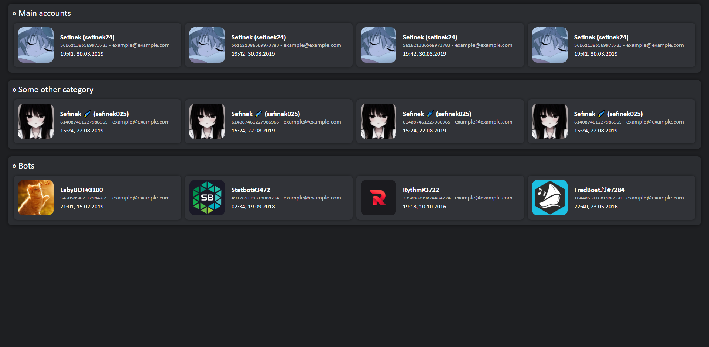

# Discord Alts Page


# How to use
1. Install Node.js
2. Clone this repo:
   ```bash
   git clone https://github.com/sefinek24/discord-alts-page
   ```
3. Rename:
   `ids.default.js` -> `ids.js` \
   `.env.default` -> `.env`
4. Run the web server:
   ```bash
   node index.js
   ```
   or
   ```bash
   node .
   ```